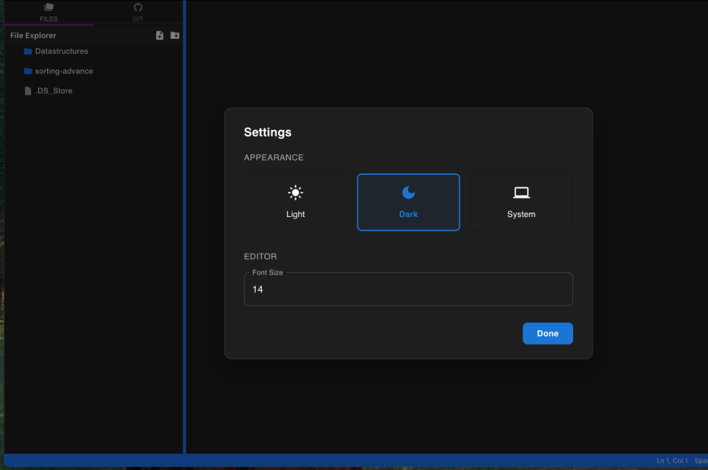
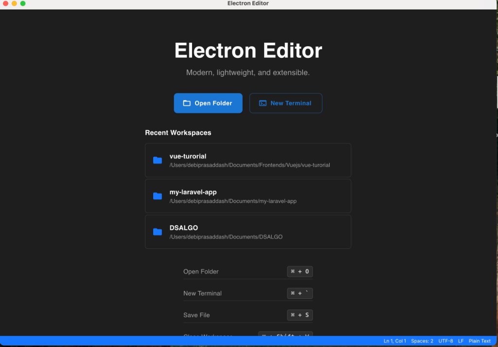
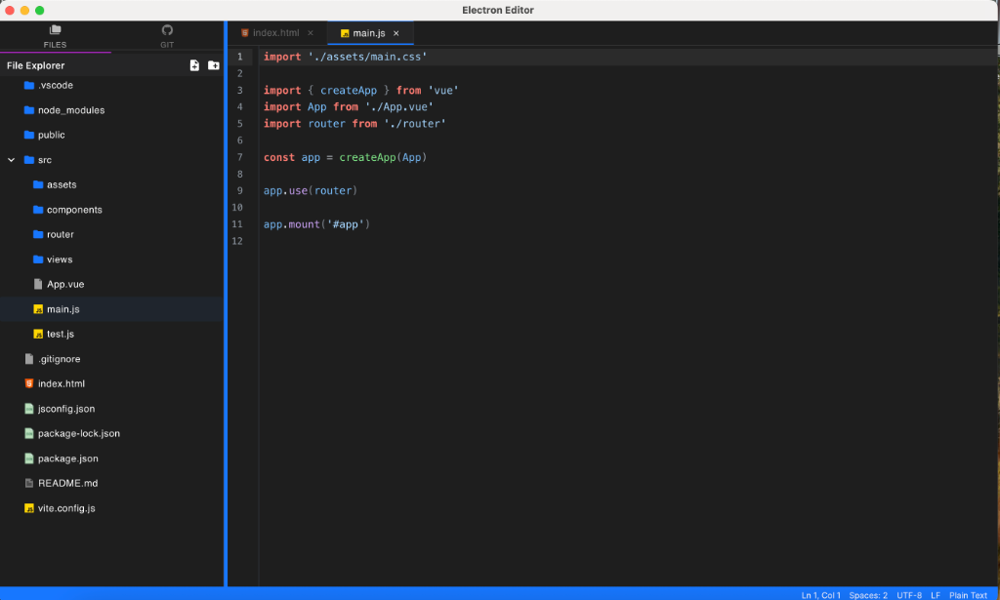
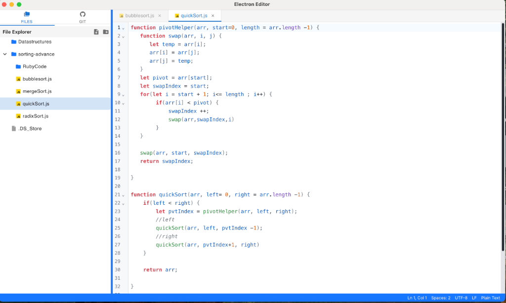

# Electron Editor Wiki

Welcome to the **Electron Editor** wiki! This project is a modern, lightweight, and extensible code editor built with React, Electron, and TypeScript.

## Features

### 1. Modern Theming
Electron Editor comes with a built-in theme engine that supports **Light**, **Dark**, and **System** modes. The theme applies consistently across the entire application, including the window title bar, context menus, and modals.

**Settings & Dark Mode:**


### 2. Welcome Experience
When no folder is open, the **Welcome Screen** provides quick access to:
-   **Open Folder**: Start working on your project immediately.
-   **Recent Workspaces**: One-click access to your frequently used projects.
-   **Keyboard Shortcuts**: Handy reference for power users.

**Welcome Screen:**


### 3. Powerful Editor
The core editor offers a rich coding experience with:
-   **Syntax Highlighting**: Powered by CodeMirror for various languages.
-   **File Explorer**: Intuitive tree view for managing your project files.
-   **Tabbed Interface**: Work on multiple files simultaneously.
-   **Integrated Terminal**: Run shell commands directly within the editor.

**Dark Mode Editor:**


**Light Mode Editor:**


### 4. Git Integration
The editor automatically detects Git repositories and displays the current **Git Branch** in the footer, helping you stay aware of your version control context.

## Getting Started

To start the application in development mode:

```bash
npm install
npm run dev
```

To build for your platform:

```bash
npm run dist
```
